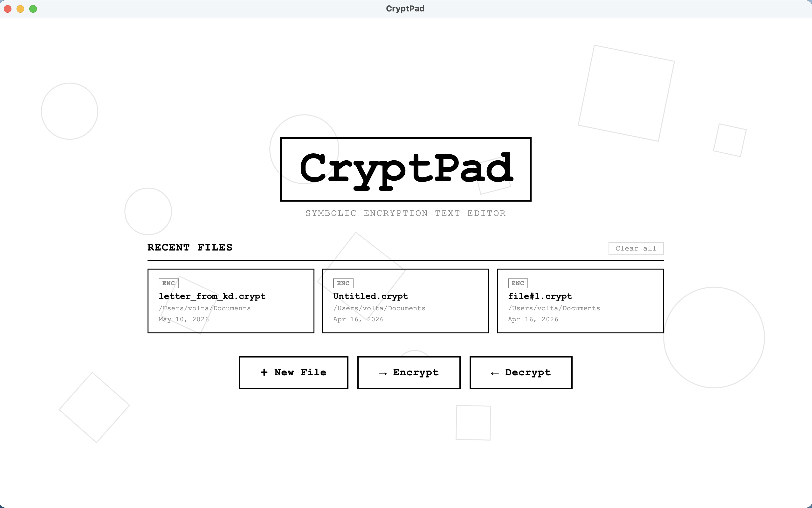

# CryptPad

A desktop text editor with built-in symbolic encryption. Write plain text, save it as a `.crypt` file, and the contents become a stream of mathematical and arrow symbols that won't open as readable text in any other editor. Reopen it in CryptPad to decrypt back to the original.

Built with TypeScript + Electron.



## Features

- Plain-text editor with tabs, line numbers, an explorer sidebar, and recent-files home screen
- Symbolic substitution cipher: letters map to unique Unicode symbols (math symbols for lowercase, arrows for uppercase); digits and punctuation pass through
- `.crypt` file format with a `CRYPTPAD::V1::` magic header so the app can detect and decrypt files it owns
- Multi-file open, save / save-as, native menus, and keyboard shortcuts (`Ctrl/Cmd+N/O/D/S`)
- Built-in cipher key reference modal so you can read the mapping at any time

## Requirements

- Node.js 18+
- npm

## Setup

```bash
npm install
```

## Running

```bash
npm start
```

This compiles the TypeScript sources in `src/` to `dist/` and launches Electron.

For iterative development, run the TypeScript compiler in watch mode in one terminal and Electron in another:

```bash
npm run watch
# in a second terminal
npx electron .
```

## Usage

- **New** — start a blank document
- **Encrypt** — open one or more `.txt` files; save them back out as `.crypt` to encrypt
- **Decrypt** — open `.crypt` files; their content is decrypted into the editor
- **Save** — writes `.txt` as plain text, writes `.crypt` with the magic header + encrypted body
- **Key** — open the cipher reference modal

## How the cipher works

It's a fixed monoalphabetic substitution — no password, no key derivation. Each letter has one Unicode counterpart (see `src/cipher.ts`). This is meant for casual obfuscation and as a fun symbolic notation, **not** for protecting sensitive data. If you need real encryption, use a tool that does authenticated encryption with a key (age, gpg, etc.).

## Project layout

```
src/
  main.ts      Electron main process — windows, menus, file & dialog IPC
  preload.ts   Context bridge exposing IPC to the renderer
  renderer.ts  UI logic — editor, tabs, sidebar, recent files
  cipher.ts    Substitution maps + encrypt / decrypt
index.html     Home screen + workspace markup
styles.css     All styling
```

## Scripts

| Script | What it does |
| --- | --- |
| `npm run build` | Compile TypeScript to `dist/` |
| `npm start` | Build, then launch Electron |
| `npm run watch` | Incremental TypeScript compile |
